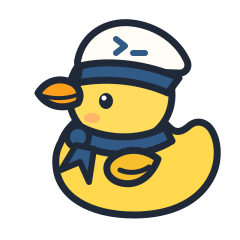
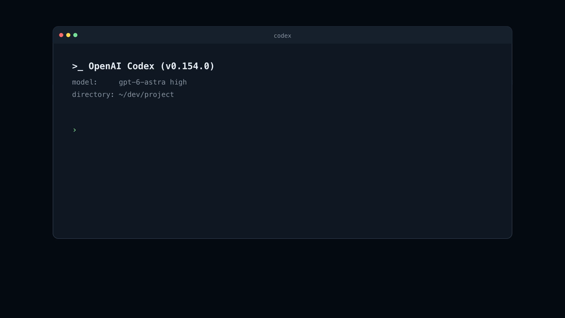

# coduck

**multiple chatgpt accounts. one codex cli.**

the name combines codex with rubber duck debugging: a small coding companion
that lets you choose which account talks to codex.

switch between work, personal, and school accounts while keeping your chatgpt
desktop app signed in. your codex settings, instructions, skills, memories, and
local sessions stay shared. your usual `codex` login stays separate.



## install

requires **macos** and **codex cli 0.154.0**.

1. install with curl

```sh
curl --proto '=https' --tlsv1.2 -LsSf \
  https://github.com/canu0205/coduck/releases/latest/download/coduck-installer.sh | sh
```

make sure `~/.cargo/bin` is on your `PATH`.

2. build from source

to build from source, install rust 1.90+ and run:

```sh
cargo install --git https://github.com/canu0205/coduck --locked
```

## use

```sh
coduck login work
coduck login personal
coduck list

coduck run work
coduck run personal
coduck run personal --resume SESSION_ID

coduck logout personal
```

- each name saves a separate login. run the same profile in multiple terminal
  panes, tabs, or windows. closing a session keeps you signed in.

- `coduck logout personal` signs out only that profile. close its other running
  sessions first; login/logout cannot change credentials used by another session.

- local history is shared. resuming with another account sends that conversation's
  context using the selected account.

- early macos prototype. other codex versions, named codex configuration profiles,
  and ctrl-z suspension are not supported yet.

## release

update the version in `Cargo.toml`, run the checks, commit it, then push a signed
tag:

```sh
cargo check
cargo fmt --all --check
cargo clippy --all-targets -- -D warnings
cargo test
git add Cargo.toml Cargo.lock
git commit -m "release vX.Y.Z"
git tag -s vX.Y.Z -m vX.Y.Z
git push origin main vX.Y.Z
```

`dist` builds both macos architectures and publishes the github release.

## license

mit. the mascot is cc0.
